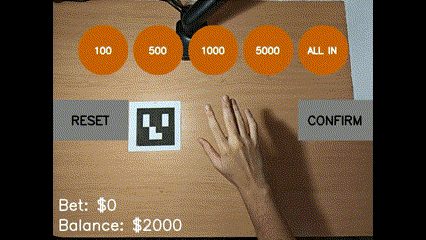
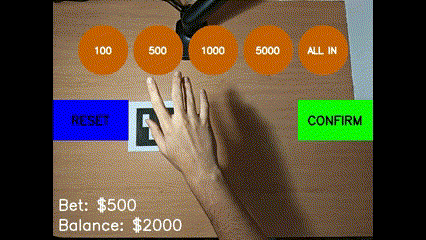
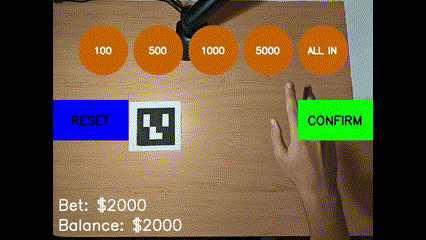
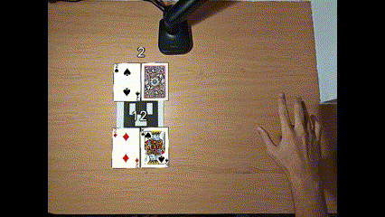
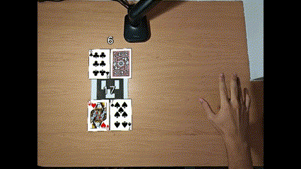
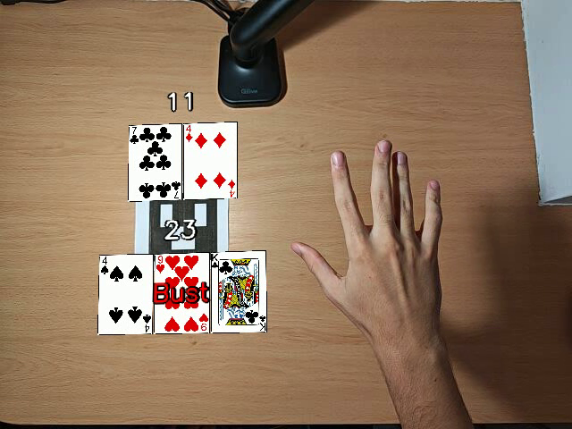
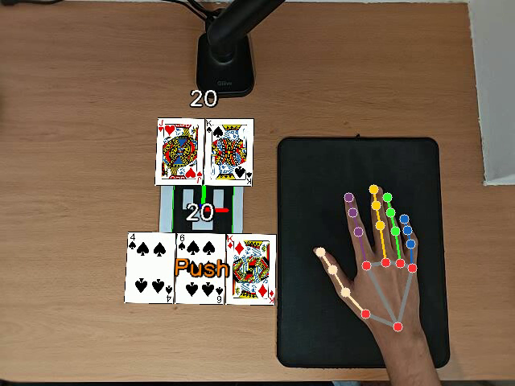
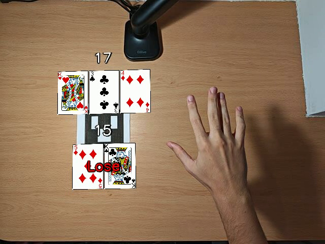
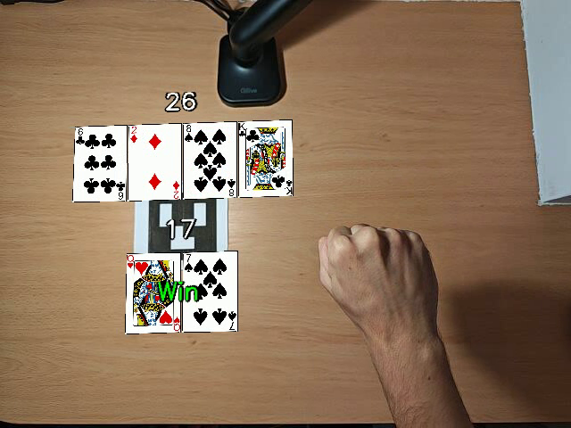

# Blackjack-AR

## Instalación del entorno

### Crear el entorno

Dentro de la consola de anaconda se crea un entorno con el nombre `BlackjackAR`:

```bash
conda create --name=BlackjackAR python=3.11.5
```

### Activar el entorno

Una vez creado el entorno, se activa mediante:

```bash
conda activate BlackjackAR
```

### Instalar los paquetes

Instalar los paquetes en el entorno activado:

#### Instalar `numpy`

```bash
conda install numpy
```

#### Instalar `cv2` (OpenCV)

Instalar la versión de openCV que contiene las utilidades para manejar ArUco:

```bash
pip3 install opencv-contrib-python==4.6.0.66
```

#### Instalar `mediapipe`

Instalar `mediapipe` encargado del reconocimiento de manos:

```bash
pip install mediapipe
```

## Reglas del Blackjack

Para esta demostración, el juego seguirá las reglas básicas del Blackjack que se encuentran en [la página de Wikipedia](https://es.wikipedia.org/wiki/Blackjack).

### 1. Objetivo del Juego

El objetivo principal es conseguir una mano que:

- Sume exactamente 21 puntos, o se acerque lo más posible a 21 sin pasarse
- Supere el valor de la mano del croupier sin pasarse de 21

### 2. Valor de las Cartas

- **Cartas Numéricas (2-10)**: Valen su valor nominal
- **Figuras (J, Q, K)**: Valen 10 puntos cada una
- **As**: Vale 1 u 11 puntos (se elige el valor que más beneficie al jugador)

### 3. Desarrollo del Juego

- Cada jugador recibe 2 cartas boca arriba
- El croupier recibe 1 carta boca arriba y 1 boca abajo
- Los jugadores juegan sus manos antes que el croupier
- El croupier debe:
  - Pedir carta con 16 puntos o menos
  - Plantarse con 17 puntos o más

### 4. Reglas Específicas

- **Blackjack Natural**:
  - Combinación de As + carta de valor 10 en las dos primeras cartas
  - Paga 3:2 de la apuesta original
- **Split**:
  - Disponible con dos cartas del mismo valor
  - Requiere una apuesta igual a la original
- **Double**:
  - Doblar la apuesta inicial
  - Solo se recibe una carta adicional
- **Push**:
  - Empate con el croupier
  - Se devuelve la apuesta original
- **Bust**:
  - Superar los 21 puntos
  - Pérdida automática de la apuesta

### 5. Estructura de Pagos

- **Victoria normal**: 1:1 (apuesta x 1)
- **Blackjack natural**: 3:2 (apuesta x 1.5)
- **Empate**: Devolución de la apuesta
- **Derrota**: Pérdida de la apuesta

## Como jugar

El BlackJack es un juego de cartas donde el objetivo es conseguir un valor de 21 puntos o el más cercano posible sin pasarse. Se juega contra el croupier (la casa) y consta de dos fases principales:

### Fase de Apuesta

1. Al inicio de cada ronda, el jugador debe realizar una apuesta inicial.
2. La apuesta mínima está establecida en 100€ y no hay máxima(inicialmente 2000, la cantidad de fichas que tiene el jugador).
3. Los chips disponibles son de: 100€, 500€, 1000€, 5000€ y all-in.
4. El jugador debe tener suficiente saldo en su cuenta para realizar la apuesta.







### Fase de Juego

1. Una vez realizada la apuesta, se reparten dos cartas al jugador (visibles) y dos al croupier (una visible y otra oculta).
2. El valor de las cartas es el siguiente:
   - Cartas numéricas (2-10): Valor nominal
   - Figuras (J, Q, K): 10 puntos
   - As: 1 u 11 puntos (el valor que más beneficie al jugador)
3. El jugador debe decidir su estrategia basándose en sus cartas y la carta visible del croupier.

## Movimientos de la Mano

### Split

- Disponible cuando las dos primeras cartas tienen el mismo valor.
- Divide la mano en dos manos independientes.
- Requiere realizar una apuesta igual a la inicial para la segunda mano.
- Cada mano se juega por separado.
- La acción se realiza teniendo levantado solo el pulgar y el índice.


### Double

- Permite doblar la apuesta inicial.
- Solo se puede realizar con las dos primeras cartas.
- El jugador recibirá una única carta adicional.
- La mano termina automáticamente después de recibir esta carta.
- La acción se realiza teniendo levantado el índice y el corazón.


### Hit

- Solicitar una carta adicional.
- Se puede pedir tantas cartas como se desee mientras no se superen los 21 puntos.
- Si se superan los 21 puntos, la mano se pierde automáticamente (Bust).
- La acción se realiza levantando únicamente el dedo índice.



### Stand

- Mantener la mano actual sin pedir más cartas.
- La jugada pasa al croupier.
- El croupier debe pedir carta si tiene 16 o menos y plantarse con 17 o más.
- La acción se realiza al cerrar el puño.



## Posibles Resultados

### Bust

- El jugador o el croupier superan los 21 puntos.
- Si el jugador se pasa, pierde automáticamente su apuesta.
- Si el croupier se pasa y el jugador no, el jugador gana.



### Push

- Empate entre el jugador y el croupier.
- Se devuelve la apuesta al jugador.
- Ocurre cuando ambos tienen el mismo valor de puntos.



### Lose

- El jugador pierde su apuesta cuando:
  - Se pasa de 21 puntos (Bust)
  - El croupier tiene una mano con mayor valor (sin pasarse de 21)



### Win

- El jugador gana su apuesta cuando:
  - Obtiene un BlackJack natural (As + carta de valor 10) y el croupier no
  - Su mano tiene mayor valor que la del croupier (sin pasarse de 21)
  - El croupier se pasa de 21
- Un BlackJack natural paga 3:2
- Las demás victorias pagan 1:1



## Vídeo de demostracción

[Demo BlackJackAR](https://youtu.be/LgWuBaNY40c)

## Explicación del Código

Para una explicación más detallada del código ir a [Explicación](model/README.md)

---
Saúl Antonio Cruz Pérez  
Carlos Mireles Rodríguez

Universidad de las Palmas de Gran Canaria  
Escuela de Ingeniería en Informática  
Grado de Ingeniería Informática  
Visión por Computador  
Curso 2024/2025
